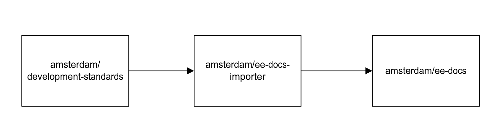

# Importing docs

The primary documentation is stored in a separate repository [development-standards](https://github.com/Amsterdam/development-standards/). This is to enable a clean markdown-only repository and prevent any vendor lock-in with a specific documentation system.

## How to import the latest documentation

To import the latest docs, run the command `npm run import-docs`.

This is the equivalent of `node ./node_modules/ee-docs-importer ./imported-docs`, which uses [ee-docs-importer](https://github.com/Amsterdam/ee-docs-importer/) to copy the latest valid markdown files from [development-standards](https://github.com/Amsterdam/development-standards/) to the `imported-docs` directory.

It copies valid markdown files from [development-standards](https://github.com/Amsterdam/development-standards/) `backend`, `frontend` and `general` directories, as well as the `intro.md` file in the root directory.

## Adding docs to the sidebar navigation

The `/sidebars.ts` file is responsible for the documentation sidebar navigation. New files should also be included to the relevant section in this file. Documentation regarding the syntax can be found in [the Docusaurus docs](https://docusaurus.io/docs/sidebar/items).
